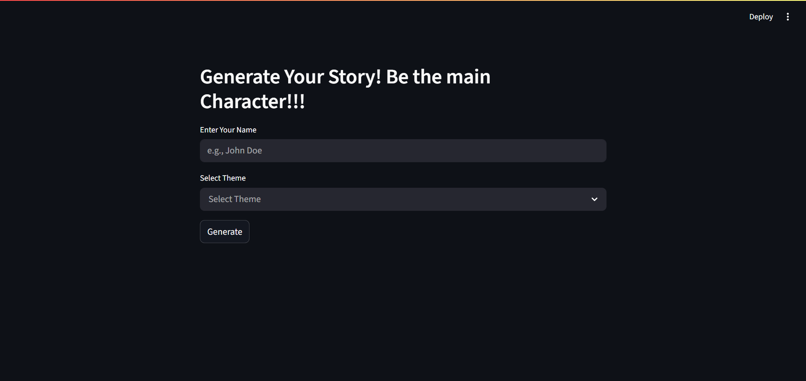
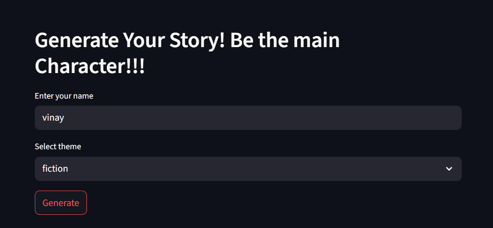
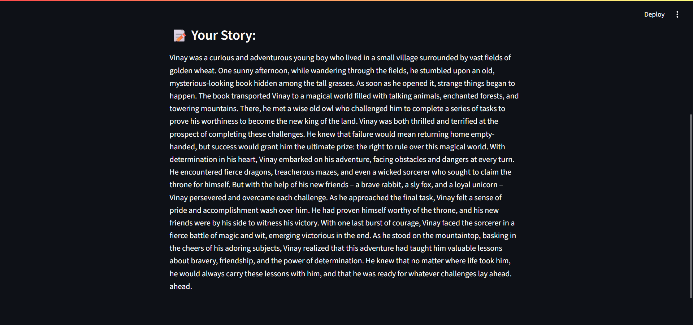

# TheAdventure - A Story Teller App

A simple Streamlit-based web app that generates personalized stories using a locally hosted LLaMA-based language model. Give your name and choose a theme — and watch your custom story unfold Like a Magic!

---
## 🚀 Features

- 🎭 Generates random stories with user as the main character
- 🌌 Choose from 4 themes: Fun, Horror, Fantasy and Fiction
- 🧠 Powered by Llama-2-7B-Chat-ggml
-- [download](https://huggingface.co/localmodels/Llama-2-7B-Chat-ggml/tree/main)  
- 🖥️ Lightweight UI using Streamlit

## 🧰 Tech Stack

- Python 🐍
- Streamlit 🎨
- LangChain 🧠
- CTransformers 🤖


## 📁 Project Structure
```graphql
.
├── app.py                  # Main Streamlit app
├── model/                  # Folder for GGUF model
├── screenshots/            # folder for Sample Screenshots
├── requirements.txt        # Python dependencies
└── README.md
```

---
## 🔧 Installation

1. **Clone the Repository**
```bash
git clone https://github.com/vinaykumarng/story-teller-app.git
cd story-teller-app
```
2. **Create Virtual Environment**
```bash
python -m venv .venv
source .venv/bin/activate       # On Windows: .venv\Scripts\activate
```
3. **Install Requirements**
```bash
pip install -r requirements.txt
```
4. **Download Model**
```graphql 
Place the GGUF model file in a folder called model at the root level.
For example:
story-teller-app/
├── model/
│   └── mistral-7b-instruct-v0.1.Q2_K.gguf
```
5. **Run the App**
```bash
streamlit run app.py
```

## 📝 Usage
- Enter your name.
- Select your preferred story theme.
- Click "Generate" to read your story.

## 📸 Demo

### Main page

### Sample Input

### Sample story


---
## 👨‍💻 Author

**Vinay Kumar N G**  
🔗 [GitHub ](https://github.com/vinaykumarng)  
🔗 [LinkedIn ](https://www.linkedin.com/in/vinay-kumar-ng-22aa97303/)


